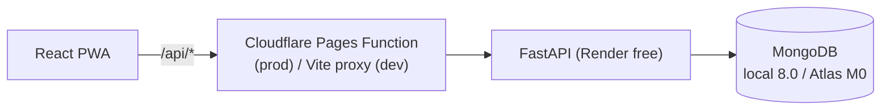
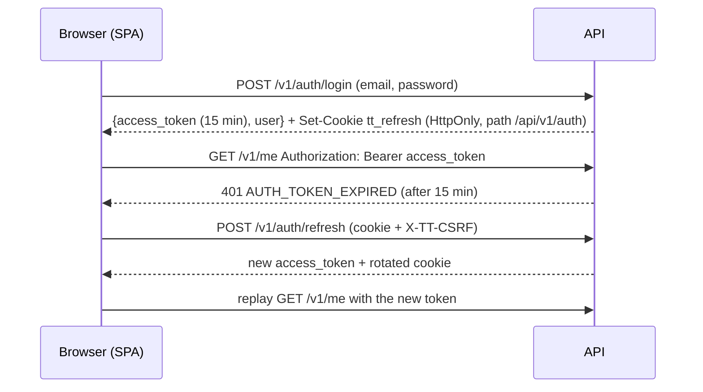

# Architecture

This page summarizes how the system is built today. The full design and its rationale are in
[plan.md](plan.md), and individual decisions are in [adr/](adr/).

## System



The browser reaches the API **same-origin** through `/api`:
- in development, through the Vite dev-server proxy;
- in production, through a Cloudflare Pages Function.

This keeps the refresh-token cookie first-party and makes CORS unnecessary (ADR-0003, ADR-0006).

## Backend layers

| Layer | Package | May import |
|---|---|---|
| Core | `app.core` | stdlib, third-party |
| Platform | `app.platform` | core |
| Modules | `app.modules.<key>` | `app.platform` only (the names it re-exports) |

`app.main` composes everything. import-linter (`pyproject.toml`) fails CI if:
- a lower layer imports a higher one;
- one module imports another;
- a module imports `app.core` or a platform sub-package instead of `app.platform`.

`tests/architecture/test_module_boundaries.py` checks the same import rule with an AST scan,
so it also covers platform sub-packages added later and the test-only modules.

## Request lifecycle

1. **`RequestContextMiddleware`** (outermost):
   - takes a valid incoming `X-Request-ID` or generates one;
   - stores it in a contextvar and in `request.state`;
   - binds it to every log line;
   - writes one `http_request` access-log event (health probes are logged at DEBUG).
2. **`SecurityHeadersMiddleware`**:
   - `nosniff`, `DENY` framing, `no-referrer`, `no-store`;
   - HSTS when `SECURITY_HSTS_MAX_AGE_SECONDS > 0`.
3. **`CORSMiddleware`**: only installed when `CORS_ALLOWED_ORIGINS` is set.
4. **Router → service → repository.** Services raise `AppError` subclasses.
5. **Exception handlers** render every failure as
   `{code, message, details, request_id}`. Unhandled errors are logged with their stack trace
   and returned as a generic `INTERNAL_ERROR`, so internals never leak.

## Database lifecycle

`Database` (in `app.core.db`) owns a single `AsyncMongoClient`.

**Startup.** `check_ready()` pings the server and runs `init_beanie` once. If MongoDB is
unreachable, the app still starts: `/readyz` returns 503, and the next successful check
initializes Beanie, so no restart is needed. This matters for Atlas M0 maintenance and
Render cold starts.

**Shutdown.** The lifespan closes the client.

## Authentication and sessions



**Access token.** A JWT signed with `AUTH_JWT_SECRET`. Claims:

| Claim | Meaning |
|---|---|
| `sub` | user id |
| `role` | user role |
| `tv` | token version |
| `sid` | session id |
| `exp` | expiry: 15 minutes |

`authenticated_user` reloads the user on every request and checks `disabled_at`, `deleted_at`
and `tv`. Bumping `token_version` (password change, logout-all, admin reset) therefore
invalidates every outstanding access token at once.

**Refresh sessions** (`auth_sessions`, one per device):
- The record stores only SHA-256 digests.
- Each refresh swaps in a new token and keeps the previous digest.
- A replaced token coming back revokes the session. Within 10 s it is a two-tab race instead
  (409, retry).
- Expiry slides 30 days per use and is capped at 90 days.
- A TTL index purges records a week after the session ends.

**Dependencies:**

| Dependency | Who passes |
|---|---|
| `CurrentUser` | Signed in, no pending password change (the default) |
| `CurrentUserAllowingPasswordChange` | Also accounts with a pending change. Only `GET /v1/me`, password change and logout-all use it |
| `AdminUser` | Admin role |
| `UserScope` | Provides the caller's data `Scope` |

**Lockout and rate limits.**
- Failed logins count per account. At `AUTH_LOCKOUT_THRESHOLD` the account locks for 60 s,
  doubling with each further failure up to 1 h.
- Auth endpoints are also rate-limited per client IP.

## Data access and isolation

User-owned documents extend `OwnedDocument`: `user_id`, `module_key`, `created_by` /
`updated_by`, timestamps and `deleted_at`.

They are read and written only through `ScopedRepository`, which:
- ANDs `{user_id: scope.owner}` and `{deleted_at: null}` into every query;
- stamps ownership on create, whatever the caller passed;
- answers 404 for records that are missing, malformed or owned by someone else.

`Scope.unrestricted()` (admin, no owner filter) is allowed only under `app/platform/admin/`.

Three test suites enforce these rules:
- `tests/isolation/test_route_matrix.py`: user B gets 404 on user A's resource for **every**
  `/v1` route with an id. New routes must register a resource factory there.
- `tests/architecture/test_access_rules.py`: every non-public `/v1` route returns 401 to an
  anonymous caller, and the unrestricted-scope rule holds.
- Both suites read the route inventory from the OpenAPI schema. FastAPI keeps included
  routers nested, so `app.routes` alone would miss routes.

## Modules

A module is a folder under a package listed in `MODULES_PACKAGES` (default `app.modules`;
tests add `tests.fixtures.modules`) with a `manifest.py`:

```python
MANIFEST = ModuleManifest(
    key="expenses", version="0.1.0", status=ModuleStatus.LIVE, order=10,
    settings_model=ExpenseSettings,                   # extra="forbid", validated per user
    router="app.modules.expenses.router:router",      # mounted at /v1/expenses
    admin_router="app.modules.expenses.admin:router", # mounted at /v1/admin/expenses
    documents=("app.modules.expenses.models:Expense",),
    tile_stat="app.modules.expenses.stats:month_total",  # async (scope, clock) -> TileStat
)
```

**Discovery** (`platform/modules/discovery.py`) runs in `create_app`, before the database
starts. It imports each manifest and checks that:
- the key equals the folder name and is unique across packages;
- every import path stays inside the module's own package and resolves to the right kind of
  object (router, Beanie document, async function);
- a settings model forbids unknown fields, and a coming-soon module has no routes.

Any failure stops startup with a message naming the module. The registry then registers the
documents with Beanie and mounts the routers. Name, icon and colour are not here: they live
in the module's frontend folder, so the backend describes behaviour only.

**What a user sees** (`GET /v1/modules`) is three layers merged, later ones winning:

| Layer | Stored in | Controls |
|---|---|---|
| Manifest | code | status, default order, enabled by default |
| Admin override | `modules` (written by the admin console, Phase 10) | status, global on/off, order |
| User preference | `user_modules`, one per user and module | on/off for me, pinned, position, settings, notify-me |

A module is **available** when it is globally enabled, enabled for the user and not coming
soon. Available modules also get their `tile_stat` figure. Stats run in parallel with a
timeout (`MODULES_TILE_STAT_TIMEOUT_SECONDS`), and a failing stat is logged and skipped, so
one broken module never breaks the Welcome page.

**Availability is enforced on the server.** Every module route sits behind a gate dependency
(signed in, then available) that answers `403 MODULE_DISABLED` before the module's code runs.
Admin routes skip the gate, so admins can still manage a module's data while it is off.

**Catalog endpoints** (`platform/modules/router.py`):
- `GET /v1/modules` (filters `status`, `pinned`; sort `position` or `key`) and
  `GET /v1/modules/{key}`;
- `PATCH /v1/modules/{key}/preferences` (pin, on/off) and `PUT /v1/modules/order`;
- `POST/DELETE /v1/modules/{key}/interest` ("notify me", coming-soon modules only);
- `GET /v1/modules/{key}/settings/schema`, and `GET/PUT /v1/modules/{key}/settings`.

Module keys are a shared catalog, not owned records: every call changes only the caller's own
`user_modules` record. Preference writes are single atomic upserts, so two tabs can't create
duplicates. Stored settings that a newer module version no longer accepts fall back to their
defaults instead of failing.

## Configuration

`app.core.config` is the only module that reads the environment.

Each concern is a frozen `BaseSettings` group with its own prefix:

| Prefix | Group |
|---|---|
| `APP_` | `AppSettings` |
| `MONGO_` | `MongoSettings` |
| `LOG_` | `LogSettings` |
| `CORS_` | `CorsSettings` |
| `SECURITY_` | `SecuritySettings` |
| `AUTH_` | `AuthSettings` (tokens, cookie, registration, password policy, lockout, Google) |
| `RATE_LIMIT_` | `RateLimitSettings` |
| `API_` | `ApiSettings` (page sizes) |
| `DEFAULT_` | `DefaultsSettings` (new-account locale, currency, time zone) |
| `MODULES_` | `ModulesSettings` (packages to discover, tile-stat timeout) |
| `BOOTSTRAP_ADMIN_` | `BootstrapSettings` (`poe seed`) |

Sources, from lowest to highest priority:
1. `.env`
2. `environments/<APP_ENV>.env`
3. real environment variables

`create_app(settings)` stores the `Settings` object on `app.state`. Dependencies read it from
there, so each test gets an isolated app.

## Observability

- Logs are JSON on stdout, which Render collects.
- Each line carries `timestamp` (UTC), `level`, `logger`, `event`, plus `request_id` during
  requests.
- Sensitive keys are masked by the `Redactor` processor. The default list is in
  `LOG_REDACT_KEYS`.

## Testing

Tests run against a **real MongoDB**: `TEST_MONGO_URI` (default `localhost:27017`), using a
throwaway database `tt-test-<random>` that is dropped after the session.

They are hermetic: settings variables from the shell or `.env` are stripped. A test-only
module, `tests/fixtures/modules/notes`, goes through the same discovery as real modules and
backs the isolation, RBAC and gate tests.

`Database` removes the query attributes Beanie writes onto abstract base documents (such as
`OwnedDocument`) after initialisation. Without this, a document class defined later in the
same process would inherit `"_id"` as its default id. Apps are built
with explicit `Settings` through `tests/helpers.build_settings` and exercised in-process
(`asgi-lifespan` + `httpx.ASGITransport`).
