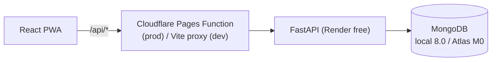

# Architecture

This page summarizes how the system is built today. The full design and its rationale are in
[plan.md](plan.md), and individual decisions are in [adr/](adr/).

## System

The browser reaches the API **same-origin** through `/api`:
- in development, through the Vite dev-server proxy;
- in production, through a Cloudflare Pages Function.

This keeps the refresh-token cookie first-party and makes CORS unnecessary (ADR-0003, ADR-0006).

## Backend layers

| Layer | Package | May import |
|---|---|---|
| Core | `app.core` | stdlib, third-party |
| Platform | `app.platform` | core |
| Modules | `app.modules.<key>` | core, platform public surface |

`app.main` composes everything. import-linter (`pyproject.toml`) fails CI if a lower layer
imports a higher one.

## Request lifecycle

1. **`RequestContextMiddleware`** (outermost):
   - takes a valid incoming `X-Request-ID` or generates one;
   - stores it in a contextvar and in `request.state`;
   - binds it to every log line;
   - writes one `http_request` access-log event (health probes are logged at DEBUG).
2. **`SecurityHeadersMiddleware`**:
   - `nosniff`, `DENY` framing, `no-referrer`, `no-store`;
   - HSTS when `SECURITY_HSTS_MAX_AGE_SECONDS > 0`.
3. **`CORSMiddleware`**: only installed when `CORS_ALLOWED_ORIGINS` is set.
4. **Router → service → repository.** Services raise `AppError` subclasses.
5. **Exception handlers** render every failure as
   `{code, message, details, request_id}`. Unhandled errors are logged with their stack trace
   and returned as a generic `INTERNAL_ERROR`, so internals never leak.

## Database lifecycle

`Database` (in `app.core.db`) owns a single `AsyncMongoClient`.

**Startup.** `check_ready()` pings the server and runs `init_beanie` once. If MongoDB is
unreachable, the app still starts: `/readyz` returns 503, and the next successful check
initializes Beanie, so no restart is needed. This matters for Atlas M0 maintenance and
Render cold starts.

**Shutdown.** The lifespan closes the client.

## Configuration

`app.core.config` is the only module that reads the environment.

Each concern is a frozen `BaseSettings` group with its own prefix:

| Prefix | Group |
|---|---|
| `APP_` | `AppSettings` |
| `MONGO_` | `MongoSettings` |
| `LOG_` | `LogSettings` |
| `CORS_` | `CorsSettings` |
| `SECURITY_` | `SecuritySettings` |

Sources, from lowest to highest priority:
1. `.env`
2. `environments/<APP_ENV>.env`
3. real environment variables

`create_app(settings)` stores the `Settings` object on `app.state`. Dependencies read it from
there, so each test gets an isolated app.

## Observability

- Logs are JSON on stdout, which Render collects.
- Each line carries `timestamp` (UTC), `level`, `logger`, `event`, plus `request_id` during
  requests.
- Sensitive keys are masked by the `Redactor` processor. The default list is in
  `LOG_REDACT_KEYS`.

## Testing

Tests run against a **real MongoDB**: `TEST_MONGO_URI` (default `localhost:27017`), using a
throwaway database `tt-test-<random>` that is dropped after the session.

They are hermetic: settings variables from the shell or `.env` are stripped. Apps are built
with explicit `Settings` through `tests/helpers.build_settings` and exercised in-process
(`asgi-lifespan` + `httpx.ASGITransport`).
