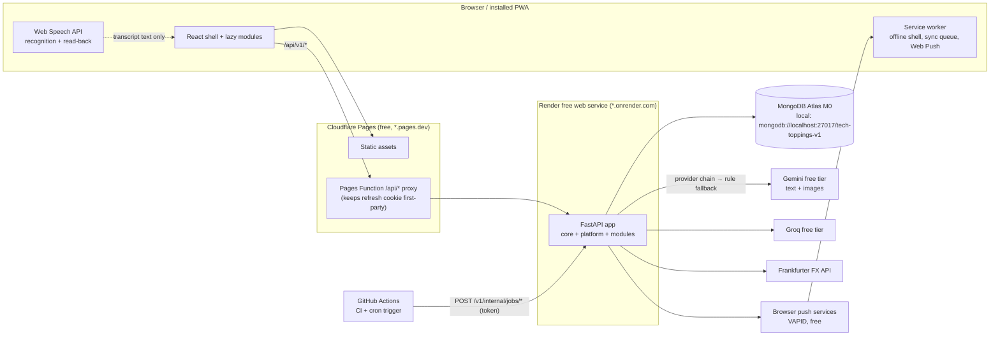

# Tech-Toppings plan (Phase 0)

**Status:** approved on 2026-10-08. Phase 1 (foundations) is implemented. Decisions are recorded in §15; deviations D1–D12 are in §14.

**Companion docs:**
- [reference-analysis.md](reference-analysis.md)
- [free-tier-limits.md](free-tier-limits.md)
- the frontend [reference-analysis.md](https://github.com/poornimapm/tech-toppings-frontend-v1/blob/develop/docs/reference-analysis.md)

---

## 1. Goals and shape

Tech-Toppings is a single shell app that hosts independent modules, and several users can
use it. Module 1 is a voice-first expense tracker. Later modules are:
- Medicine
- Receipts/Warranty
- Study Helper
- Gov-Document Helper
- Meal Planner
- Habit Tracker
- Journal

Both sides are built as a **modular monolith**:
- **Backend:** one FastAPI service. It discovers modules automatically from their
  manifests. Modules cannot import each other, and `import-linter` enforces that in CI.
- **Frontend:** one React single-page app that also works as an installable PWA. Module
  manifests are discovered at build time. Pages, widgets and translations load lazily.



There is no proxy when running locally. The Vite dev server forwards `/api` to
`http://localhost:8000`, so cookies and URLs behave the same in development and production.

### Layer rules (backend)

| Layer | May import | Contains |
|---|---|---|
| `app/core` | stdlib, third-party | Config, logging, errors, DB, base documents and repositories, security primitives, pagination, idempotency, rate limiting, clock, HTTP client. It knows nothing about users or modules. |
| `app/platform` | `core` | Auth, users, module registry, households, notifications (in-app + push), reminders, audit, AI service, dashboard, search, jobs, FX, privacy (export/delete), admin, health. The public surface is re-exported from `app/platform/__init__.py`. |
| `app/modules/<key>` | `core`, `app.platform` (public surface only) | Everything for one module. It never imports another module. |

The frontend uses the same layering: `core` → `platform` / `design-system` →
`modules/<key>`. ESLint `no-restricted-imports` blocks imports from one module into another,
and blocks deep imports into `platform` internals.

---

## 2. Key decisions (each becomes an ADR in Phase 1)

| ADR | Decision | Why |
|---|---|---|
| 0001 | Modular monolith with manifest auto-discovery, enforced by `import-linter` contracts. | Adding a module means adding a folder. A machine checks the boundaries instead of a reviewer. |
| 0002 | MongoDB + Beanie 2 on **PyMongo Async** (Motor is deprecated, see D11). Revision writes use an outbox step inside the document instead of transactions. Tests run against a **real MongoDB**. | The local mongod (8.0.26) is standalone, so it has no transactions. mongomock lacks `$dateTrunc` and `$setWindowFields`. |
| 0003 | JWT access token held in memory. Refresh token is opaque and rotates on each use; it is stored SHA-256 hashed and reuse is detected. It travels in an httpOnly, `SameSite=Strict` cookie. The API is reached same-origin through the `/api` proxy. | Third-party cookies break between `*.pages.dev` and `*.onrender.com`. Keeping tokens out of `localStorage` fixes a weakness seen in the reference. |
| 0004 | Money is an **integer number of minor units** plus an ISO-4217 currency code. Each entry stores a snapshot of `fx_rate` and `amount_base_minor`. Dates are calendar dates, with an optional local time. Entries have `kind` = `expense` or `income`. | No float rounding errors. Exact totals across currencies. Net savings computed from one ledger. |
| 0005 | All AI goes through `platform.ai.AIService`. It runs a provider chain (Gemini → Groq, from config), validates output against a schema, redacts PII, caches results, enforces a per-user quota and a global cap, and logs usage. Each module supplies its own prompts, schemas and **rule-based fallback**. | Free tiers change without notice, and capture must keep working when quota runs out. |
| 0006 | **Hosting:** Cloudflare Pages (static assets + proxy function), Render free (API, Docker) and Atlas M0. Free subdomains only, no custom domain. | Free with no card. Vercel Hobby is non-commercial only. |
| 0007 | Scheduled work has two paths. Lazy materialization runs on user activity and is the reliable path. A GitHub Actions cron calls a job endpoint protected by a token; it is best effort and also drives Web Push reminders. Retention is handled by TTL indexes. | Render free has no cron and sleeps when idle. |
| 0008 | Frontend API types are generated from the backend's OpenAPI schema with `openapi-typescript` and `openapi-fetch`. | One source of truth for shapes across both repos. |
| 0009 | i18n: the server returns error codes, and notification types with parameters. The client translates them into en, ta or hi. LLM text is generated in the user's locale and cached per locale. | Switching language needs no refetch. |
| 0010 | Offline capture queues entries in IndexedDB with an `Idempotency-Key`. When the device reconnects, offline free text is parsed on the server and lands in a "To confirm" inbox. | One parser to maintain, and no double entries. |
| 0011 | **Registration by email allowlist, with no email sending in v1.** Recovery is an admin-issued one-time password plus forced change at next login, or Google sign-in. | Protects free quotas without needing an email provider. |
| 0012 | Reminders are a platform service with two channels: in-app (reliable) and Web Push via VAPID (free, best effort, triggered by cron). | The Medicine module will reuse it for dose reminders. |

---

## 3. Folder structures

### 3.1 Backend — `tech-toppings-backend-v1`

```
app/
  main.py                      # create_app(settings) factory, lifespan, module discovery
  core/
    config.py                  # Settings (pydantic-settings), nested groups, APP_ENV-selected env file
    logging.py                 # structlog JSON/console, secret+PII redaction processor
    context.py                 # contextvars: request_id, user_id
    errors.py                  # AppError hierarchy, ErrorCode enum, handlers, envelope model
    middleware.py              # request-id, access log, timing, security headers
    db.py                      # Motor client (pooled), Beanie init(document models), ping
    documents.py               # BaseDocument, OwnedDocument (user_id, module_key, audit fields, deleted_at)
    repository.py              # BaseRepository[T], ScopedRepository[T], Scope
    pagination.py              # PageParams, SortSpec (whitelisted fields), Page[T]
    idempotency.py             # Idempotency-Key dependency + TTL store
    rate_limit.py              # `limits`-based limiter (memory or Mongo storage via config)
    security.py                # Argon2id, JWT, token hashing, password policy, field encryption (TOTP secrets)
    clock.py                   # Clock protocol (frozen in tests)
    http.py                    # shared httpx.AsyncClient factory (timeouts, retries)
    money.py                   # minor-unit helpers, ISO-4217 exponents
    units.py                   # unit dimensions + conversion table (loaded from data file)
  platform/
    __init__.py                # PUBLIC SURFACE for modules (re-exports only)
    auth/                      # register (allowlist), login, refresh, logout, Google ID-token, lockout, TOTP
    users/                     # User doc, /v1/me, sessions, preferences
    modules/                   # ModuleManifest spec, discovery, registry sync, user prefs, settings validation
    households/                # shared-ledger groups + members (scope extension)
    notifications/             # in-app notifications + Web Push channel (subscriptions, VAPID sender)
    reminders/                 # due/remind scheduling, delivery via notifications, snooze/dismiss
    audit/                     # audit log writer + query
    ai/                        # AIService, LLMProvider protocol, providers/{gemini,groq}.py, cache, quota, pii, usage
    dashboard/                 # widget contract, aggregation of module widgets, activity feed
    search/                    # fan-out to module search providers (command palette)
    jobs/                      # job registry from manifests, lock + last-run, internal trigger endpoint
    fx/                        # exchange-rate client + daily cache
    privacy/                   # data export (module exporters) + account deletion (module erasers)
    admin/                     # /v1/admin/*: users, allowlist, modules, analytics, audit
    health/                    # /healthz, /readyz
  modules/
    expenses/
      manifest.py
      router.py                # mounts feature routers under /v1/expenses
      settings.py              # module settings schema (thresholds, retention, read-back, defaults)
      features/                # large-module layout (deviation D2)
        entries/  capture/  categories/  products/  analytics/  insights/  chat/
        budgets/  goals/  recurring/  ious/  io/  receipts/
          # each: router.py service.py repository.py schemas.py models.py
      parsing/                 # rule parser (speech, typed, bank/UPI SMS); lexicons/{en,ta,hi}.yaml; eval/
      prompts/                 # versioned prompt templates owned by this module
      tests/
    medicine/ receipts/ study/ gov_docs/ meals/ habits/ journal/   # Phase 13: manifest-only, coming_soon
tests/
  conftest.py                  # app + real-Mongo fixtures (per-run DB, dropped after)
  fixtures/modules/demo/       # test-only module, discovered via MODULE_PACKAGES in tests
  isolation/                   # route-matrix isolation suite (user A vs B, every /v1 route)
  platform/ core/
scripts/
  seed.py                      # system categories, units, demo data, admin bootstrap from env
  reset_password.py            # admin CLI: one-time password + forced change (until admin UI in P10)
  gen_vapid_keys.py            # generate Web Push VAPID key pair locally (P11)
  new_module.py                # generator (P13)
  export_openapi.py            # writes openapi.json for the frontend type generator
  eval_parser.py               # parse-accuracy report (rules / provider)
  backup_atlas.py              # mongodump wrapper (P12)
docs/
  architecture.md  adr/  modules/  plan.md  reference-analysis.md  free-tier-limits.md
  deployment.md (P12)  privacy-policy-template.md (P10)  roadmap.md (P13)
.github/workflows/ci.yml       # + jobs-cron.yml (P9a)
requirements/                  # base.lock, dev.lock — compiled from pyproject.toml by pip-tools
.venv/                         # project-level virtual env (Python 3.11), gitignored — ALL packages live here
Dockerfile  .dockerignore  docker-compose.yml  pyproject.toml
.env.example  .pre-commit-config.yaml  .gitattributes  .gitignore  README.md  CHANGELOG.md
```

The generator (Phase 13) creates new modules with the flat layout from the brief:
`manifest.py router.py service.py repository.py schemas.py models.py tests/`. Only large
modules split into `features/`.

### 3.2 Frontend — `tech-toppings-frontend-v1`

```
src/
  main.tsx                     # bootstraps providers + router
  core/
    api/                       # client.ts (openapi-fetch + auth/refresh/request-id middleware),
                               # schema.d.ts (generated), api-error.ts, query-client.ts, server-wake.ts
    auth/                      # session store (Zustand), useAuth, RequireAuth, RequireRole
    config/                    # env.ts (zod-validated import.meta.env)
    i18n/                      # i18next init, locales/{en,ta,hi}/common.json, format.ts (Intl money/date)
    theme/                     # theme store (light/dark/system), tokens.css, module accents, simple mode
    modules/                   # ModuleManifest type, registry (import.meta.glob), useModules (merge with API)
    speech/                    # useSpeechRecognition, useSpeechSynthesis (read-back), capability detection
    offline/                   # IndexedDB queue, replay, online/offline status
    push/                      # Web Push subscribe/unsubscribe, permission flow (P11)
    utils/                     # money, dates, ids
  platform/
    shell/                     # App, layouts, nav, header, waking-server banner, error boundaries
    auth/                      # login, register, TOTP step, forced password change
    welcome/                   # animated tiles page
    dashboard/                 # global dashboard + widget host
    command-palette/           # Ctrl/Cmd+K (cmdk)
    notifications/             # bell + centre, reminders list
    settings/                  # profile, language, currency, theme, simple mode, AI consent, 2FA, export, delete
    admin/                     # console (P10): users, allowlist, modules, analytics, audit
    onboarding/                # tour (P11)
    legal/                     # privacy policy + terms pages
  design-system/
    primitives/                # Button, IconButton, Input, Select, Dialog, Drawer, Tabs, Tooltip,
                               # Badge, Tile, Card, Toast, Skeleton, EmptyState, ConfirmDialog, DateRangePicker
    charts/                    # ChartFrame (title, summary, table fallback), Line, Bar, Donut, Heatmap
    motion/                    # presets honouring prefers-reduced-motion
    icons/
  modules/
    expenses/
      manifest.ts  pages/  components/  hooks/  api/  store/  widgets/  i18n/{en,ta,hi}.json
  test/                        # setup, MSW handlers, render helpers, axe helper
e2e/                           # Playwright smoke
functions/api/[[path]].ts      # Cloudflare Pages Function proxy (P12)
public/                        # icons, _headers (CSP/HSTS), robots.txt
scripts/                       # gen-api-types.ts, new-module.ts (P13)
docs/                          # architecture.md, adr/, modules/, reference-analysis.md
.github/workflows/ci.yml  index.html  vite.config.ts  tsconfig*.json  eslint.config.js
.prettierrc  .husky/  .env.example  .nvmrc  package.json  README.md  CHANGELOG.md
```

---

## 4. Module manifest design

### 4.1 Backend `ModuleManifest` (Pydantic, frozen)

```python
class ModuleManifest(BaseModel):
    key: str                       # snake_case; must equal folder name
    name_key: str                  # i18n key, e.g. "modules.expenses.name"
    icon: str                      # icon token shared with frontend
    color: str                     # accent token, not a hex literal
    version: str                   # semver
    status: ModuleStatus           # live | beta | coming_soon  (default; admin can override)
    default_enabled: bool
    order: int
    permissions: list[str]         # e.g. ["expenses:read", "expenses:write"]
    settings_model: type[BaseModel] | None      # validated per user; global defaults in DB
    router: str | None             # "app.modules.expenses.router:router" (lazy import)
    documents: list[str]           # Beanie document import paths (registered at startup)
    widgets: list[WidgetSpec]      # dashboard widgets: key, kind(kpi|series|list), provider path
    tile_stat: str | None          # provider path for the Welcome-tile mini-stat
    search: str | None             # provider path for command-palette search
    jobs: list[JobSpec]            # key, cadence hint, handler path (lazy + cron-triggerable)
    exporter: str | None           # data-export hook (privacy)
    eraser: str | None             # account-deletion hook (privacy)
```

**Discovery.** For each package listed in `MODULE_PACKAGES`, `pkgutil.iter_modules()` finds
its sub-packages.
- The default is `app.modules`. Tests add `tests.fixtures.modules`.
- Each sub-package's `manifest` is imported and validated.
- Validation requires a unique key that matches the folder name, provider paths that
  resolve, and routes under `/v1/<key>`.
- If validation fails, startup fails loudly.

**Registry sync.** On startup, the `modules` collection is upserted.
- Manifest values are the defaults.
- `status`, `global_enabled` and `order` set by an admin are stored as overrides and kept.
- A module is available to a user when it is `global_enabled`, enabled in `user_modules`,
  and not `coming_soon`.
- Coming-soon modules still get a tile with a "Notify me" action.

**Settings.**
- `GET /v1/modules/{key}/settings/schema` returns the JSON Schema of `settings_model`, so
  the UI can render a generic form.
- `PUT` validates input against that model with `extra="forbid"`.

### 4.2 Frontend `ModuleManifest`

```ts
export interface ModuleManifest {
  key: string;                                   // matches backend key
  nameKey: string; icon: IconToken; accent: AccentToken;
  routes: () => Promise<{ default: RouteObject[] }>;          // lazy, mounted at /m/<key>/*
  i18n: (lng: Locale) => Promise<Record<string, unknown>>;    // lazy namespace
  widgets?: Array<{ key: string; kind: 'kpi' | 'series' | 'list';
                    component?: () => Promise<{ default: ComponentType<WidgetProps> }> }>;
  commands?: CommandSpec[];                      // command-palette actions (e.g. "Add expense")
  quickActions?: QuickActionSpec[];
  permissions: string[];
}
```

Manifests are discovered with `import.meta.glob('/src/modules/*/manifest.ts', { eager: true })`.
- The shell merges them with `/v1/modules`. The backend owns status, enabled and order.
- A key that exists on only one side is not rendered, and a warning is logged in dev mode.

---

## 5. Data model

Every user-owned document extends `OwnedDocument`, which adds these fields:
- `user_id`
- `module_key` (`"platform"` for platform documents)
- `created_at`, `updated_at`, `created_by`, `updated_by`
- `deleted_at`

`ScopedRepository` always adds the `{user_id}` filter (or a household scope) and
`{deleted_at: null}`. **TTL** marks collections that clean themselves up.

### 5.1 Platform collections

| Collection | Key fields | Indexes |
|---|---|---|
| `users` | email (lower-cased, unique), password_hash (nullable for Google-only), name, role (`admin`/`user`), locale (`en`/`ta`/`hi`), theme, ui_mode (`standard`/`simple`), base_currency, timezone, ai_consent_at, token_version, must_change_password, failed_logins, locked_until, auth_providers[{provider, subject}], totp{secret_enc, enabled_at, recovery_hashes[]}, last_login_at, disabled_at, deleted_at | `email` unique; `auth_providers.subject` |
| `allowed_emails` | email (lower-cased), note, added_by | `email` unique. The effective allowlist is `AUTH_ALLOWED_EMAILS` (env) ∪ this collection. |
| `auth_sessions` | one per signed-in device: user_id, token_hash (current refresh token), previous_token_hashes[] (reuse detection), last_used_at, rotated_at, expires_at (sliding), absolute_expires_at, purge_at, revoked_at, revoked_reason, user_agent, ip | `token_hash` unique; `previous_token_hashes`; `{user_id, revoked_at, last_used_at}`; TTL `purge_at` |
| `modules` | key, name_key, icon, color, status, global_enabled, order, overrides{} | `key` unique |
| `user_modules` | user_id, module_key, enabled, pinned, order, settings{} | `{user_id, module_key}` unique |
| `module_interest` | user_id, module_key ("Notify me") | `{user_id, module_key}` unique |
| `households` / `household_members` | name, owner_id / household_id, user_id, role (owner/editor/viewer) | `{household_id, user_id}` unique |
| `notifications` | user_id, type, params{}, read_at, dedupe_key, created_at | `{user_id, read_at, created_at}`; `{user_id, dedupe_key}` unique sparse; TTL (config) |
| `push_subscriptions` | user_id, endpoint, keys{p256dh, auth}, user_agent | `endpoint` unique; `{user_id}` |
| `reminders` | user_id, module_key, ref_id, type, params{}, due_on, remind_at, channels[`in_app`,`push`], sent_at, snoozed_until, dismissed_at | `{remind_at, sent_at}`; `{user_id, due_on}` |
| `audit_logs` | actor_id, action, entity, entity_id, owner_id, diff (redacted), ip, request_id, at | `{owner_id, at}`; `{actor_id, at}`; `{entity, entity_id}`; TTL (config, long) |
| `ai_usage` | user_id, day (in user's timezone), calls, tokens_in/out, by_provider{} | `{user_id, day}` unique; TTL |
| `ai_calls` | user_id, task, provider, model, latency_ms, status, cached, fallback_used, at | `{at}`; TTL (90 days default) |
| `llm_cache` | key (sha256 of task + schema_version + locale + normalized input), response, provider, at | `key` unique; TTL |
| `idempotency_keys` | user_id, key, route, request_hash, status_code, response, at | `{user_id, key, route}` unique; TTL 24 h |
| `rate_limits` | limiter windows (only when Mongo storage is enabled) | TTL |
| `fx_rates` | base, date, rates{} | `{base, date}` unique |
| `job_runs` | job_key, scope_key, last_run_at, lock_until | `{job_key, scope_key}` unique |

### 5.2 Expense module collections

| Collection | Key fields | Indexes |
|---|---|---|
| `expenses` | user_id, household_id?, **kind** (`expense`/`income`), product_id?, title, amount_minor, currency, fx_rate, amount_base_minor, base_currency, quantity, unit, base_quantity, unit_price_minor (per base unit, derived), category_id, merchant, payment_mode, date, time?, tags[], note, attachments[{url, label}], **for_whom?**, source (`voice`/`manual`/`sms`/`receipt`/`import`/`recurring`), confidence, capture_id?, recurring_id?, revision_no, pending_revision?, deleted_at | `{user_id, date}`; `{user_id, kind, date}`; `{user_id, product_id, date}`; `{user_id, deleted_at}`; `{user_id, category_id, date}`; `{user_id, merchant}`; `{recurring_id, date}` unique sparse |
| `expense_revisions` (append-only) | expense_id, user_id, revision_no, action (`create`/`update`/`delete`/`undelete`/`restore`), changed_at, changed_by, source, field_changes[{field, old, new}], snapshot{}, reason | `{expense_id, revision_no}` unique; `{user_id, changed_at}` |
| `categories` | user_id (null = system), kind, name_key (system) / name (custom), icon, color, order, archived | `{user_id, kind, name}` |
| `products` | user_id, canonical_name, aliases[] (normalized), default_unit, dimension (mass/volume/count/other), category_id | `{user_id, aliases}`; `{user_id, canonical_name}` unique |
| `budgets` | user_id, scope (`overall`/`category`/`tag`), category_id?, tag?, period (`week`/`month`/`custom`), start?/end? (custom = trip/event), limit_minor, currency, alert_threshold (0–1) | `{user_id, scope, period}` |
| `goals` | user_id, name, target_minor, currency, target_date, funding (`manual`/`net_savings`), contributions[{amount_minor, date, note}] | `{user_id}` |
| `recurring_rules` | user_id, template{entry fields}, cadence (daily/weekly/monthly/yearly + interval + anchor), next_run (date), **mode** (`auto_create` / `remind` = bill), remind_days_before, active, source (`detected`/`manual`) | `{user_id, next_run}` |
| `recurring_suggestions` | user_id, signature, sample_ids[], cadence, dismissed_at | `{user_id, signature}` unique |
| `ious` | user_id, counterparty, direction (`lent`/`borrowed`), amount_minor, currency, date, due_on?, note, settlements[{amount_minor, date, note}] (append-only), settled_at, deleted_at | `{user_id, settled_at, due_on}`; `{user_id, counterparty}` |
| `capture_sessions` | user_id, input_type (`speech`/`text`/`sms`/`receipt`), transcript, locale, intent, parsed{}, parser (`llm:<provider>`/`rules`), created_at | TTL = `EXPENSES_TRANSCRIPT_RETENTION_DAYS` (0 = never stored) |
| `insights` | user_id, period, period_start, locale, facts_hash, content, generator, generated_at | `{user_id, period, period_start, locale}` unique |
| `saved_filters` | user_id, name, query{} (typed filter model) | `{user_id, name}` unique |

Receipt images are **never stored**. They are processed in memory, and only the extracted
entries are saved. This keeps the brief's rule that attachments are links only.

**Revision writes without transactions (ADR-0002):**
1. A conditional update on `{_id, user scope, revision_no: n}` sets the new fields, sets
   `revision_no = n+1`, and sets `pending_revision = {diff, snapshot, meta}`.
2. The `expense_revisions` row for `n+1` is inserted. The unique index makes this step
   idempotent.
3. `pending_revision` is unset.

If step 2 or step 3 never runs:
- the next read of that document completes the revision;
- a background job does the same for idle documents.

If the conditional update in step 1 finds the version has moved on, the API returns
`409 EXPENSE_VERSION_CONFLICT`.

**Seeds** (`scripts/seed.py`) are idempotent:
- System categories for expense and income, read from `seed/categories.yaml`.
- The unit table.
- The admin user from `BOOTSTRAP_ADMIN_EMAIL` / `BOOTSTRAP_ADMIN_PASSWORD`. This email is
  always allowlisted.
- With `--demo`: two demo users with 90 days of multilingual entries, incomes and IOUs.

---

## 6. Security design (summary)

**Registration (allowlist).** `AUTH_REGISTRATION_MODE` is `allowlist` (default), `open` or
`closed`.
- Register and Google sign-in both check the allowlist and return
  `403 REGISTRATION_NOT_ALLOWED` for anyone not on it.
- Before Phase 10 the list comes from `AUTH_ALLOWED_EMAILS` in the env. From Phase 10 the
  admin console manages it in the DB.

**No email in v1.** There is no forgot-password, reset or verification email. Recovery works
like this:
- The admin runs `poe reset-password --email …` (from Phase 10, an admin console button).
- That issues a one-time password, shown once.
- `must_change_password` forces the user to set a new password at the next login.
- Google sign-in, when configured, is the self-service recovery path.

**Passwords.** Argon2id. The policy (minimum length, character classes, must not contain the
email) comes from config.
- Failed logins trigger exponential lockout (`AUTH_LOCKOUT_*`).
- Auth routes are rate-limited per IP.

**Access token.**
- Lifetime: 15 min (config).
- Claims: `sub`, `role`, `tv` (token_version), `jti`.
- The user is loaded on every request, so disabling, role changes and password changes take
  effect immediately.

**Refresh token.**
- Sliding lifetime of 30 days, with an absolute cap of 90 days. It rotates on every use.
- Reusing an old token revokes its whole family.
- Logout revokes the current family. Logout-all, a password change or an admin reset revoke
  all families.

**Refresh cookie.**
- Attributes: `HttpOnly; Secure; SameSite=Strict; Path=/api/v1/auth`.
- `/refresh` also requires a custom header and an allowed `Origin`, which blocks CSRF.

**TOTP 2FA (optional per user).**
- Uses pyotp. The secret is encrypted at rest (Fernet, key `AUTH_FIELD_ENCRYPTION_KEY`).
- 10 recovery codes, stored hashed.
- Login becomes two steps: password, then code.
- An admin reset also clears 2FA, and that action is audited.

**Strict validation.**
- Models use `extra="forbid"`.
- Sort and filter fields come from whitelists.
- ObjectIds are validated.
- Strings have length caps and HTML is stripped.
- Image uploads (receipts) are checked for type and size, and handled in memory only.

**Ownership.**
- Requests for another user's resources get **404**, not 403.
- Unscoped admin access exists only on `/v1/admin/*`, via `Scope.all()`.
- An admin edit writes a revision with `changed_by=admin` plus an audit entry.

**Logs.**
- structlog redacts `password`, `token`, `authorization`, `cookie`, `transcript`, `email`,
  `totp` and `sms`.
- A test asserts that none of them appear in the logs.

**Headers.**
- The backend middleware sets security headers.
- Cloudflare `_headers` sets the CSP (`connect-src 'self'`, possible because of the proxy).
- HSTS is on in production. CORS allows only origins listed in `CORS_ALLOWED_ORIGINS`.

**LLM safety.**
- Input text is passed as delimited data, never as instructions.
- Output is validated against a strict schema.
- Amounts are cross-checked against numbers in the source text. A mismatch lowers confidence
  and forces confirmation.
- The model gets no tools and its output is never executed.
- Chat compiles a typed intent into a pipeline built only from whitelisted stages, with the
  user-scope `$match` always first.
- PII (emails, phone numbers, card, account, UPI and Aadhaar-like numbers) is redacted
  before any provider call.

**AI consent.** AI is **off until the user opts in** (`ai_consent_at`).
- The UI asks inline the first time the user captures by voice, SMS or receipt.
- Without consent, the rule parser handles text, and receipts need manual entry or
  client-side OCR.

**Supply chain.** CI runs `pip-audit`, `npm audit --audit-level=high`, `gitleaks` and `knip`.

**Privacy.**
- Users can export their data as JSON or CSV.
- Account deletion requires re-authentication and hard-deletes data through each module's
  eraser.
- Phase 10 adds a privacy-policy template that covers the Play Store Data Safety form.
- Raw audio and receipt images are never stored.

---

## 7. API surface (`/v1`, OpenAPI tags per module)

**Conventions**

- **Errors** use the envelope `{code, message, details, request_id}`.
- **Lists** accept `page`, `page_size` (up to `API_MAX_PAGE_SIZE`), `sort=-date,amount`
  (whitelisted fields) and typed filters. They return
  `{items, page, page_size, total, has_next}`.
- **Creates** accept an `Idempotency-Key` header.

**Health** (no version prefix): `GET /healthz`, `GET /readyz`.

**Auth** (`/v1/auth`)

| Method | Path | Notes |
|---|---|---|
| POST | `/register` | Allowlist checked |
| POST | `/login` | Returns a `totp_required` challenge if 2FA is enabled |
| POST | `/login/totp` | Second login step |
| POST | `/refresh` | |
| POST | `/logout` | |
| POST | `/logout-all` | |
| POST | `/google` | Google ID token; allowlist checked |
| POST | `/password/change` | Also clears `must_change_password` |
| POST | `/totp/setup`, `/totp/enable`, `/totp/disable`, `/totp/recovery-codes` | |

**Me** (`/v1/me`)

| Method | Path | Notes |
|---|---|---|
| GET, PATCH | `/v1/me` | Name, locale, theme, ui_mode, base_currency, timezone, AI consent |
| GET | `/v1/me/sessions` | |
| DELETE | `/v1/me/sessions/{id}` | |
| GET | `/v1/me/export` | |
| DELETE | `/v1/me` | Re-authentication required |

**Modules** (`/v1/modules`)

| Method | Path |
|---|---|
| GET | `/v1/modules` |
| PATCH | `/{key}/preferences` |
| PUT | `/order` |
| GET | `/{key}/settings/schema` |
| GET, PUT | `/{key}/settings` |
| POST, DELETE | `/{key}/interest` |

**Shell**

| Method | Path |
|---|---|
| GET | `/v1/dashboard?from&to` |
| GET | `/v1/activity` |
| GET | `/v1/search?q=` |
| GET | `/v1/fx/rates?base=` |
| GET | `/v1/ai/quota` |

**Notifications, reminders and push**

| Method | Path |
|---|---|
| GET | `/v1/notifications` |
| POST | `/v1/notifications/{id}/read` |
| POST | `/v1/notifications/read-all` |
| DELETE | `/v1/notifications/{id}` |
| GET | `/v1/reminders` |
| POST | `/v1/reminders/{id}/snooze` |
| POST | `/v1/reminders/{id}/dismiss` |
| GET | `/v1/push/vapid-public-key` |
| POST, DELETE | `/v1/push/subscriptions` |

**Admin** (`/v1/admin`)

| Method | Path | Notes |
|---|---|---|
| GET | `/users` | |
| PATCH | `/users/{id}` | Role, disabled |
| POST | `/users/{id}/revoke-sessions` | |
| POST | `/users/{id}/reset-password` | Returns a one-time password once; clears 2FA |
| GET, POST, DELETE | `/allowed-emails` | |
| GET | `/modules` | |
| PATCH | `/modules/{key}` | |
| GET | `/dashboard?from&to` | |
| GET | `/analytics/usage` | |
| GET | `/analytics/db` | |
| GET | `/audit-logs` | |
| GET, PATCH | `/expenses/entries[/{id}]` | |

**Internal:** `POST /v1/internal/jobs/{job_key}/run`, protected by the `X-Job-Token` header.
Jobs include recurring materialization, reminder dispatch, pending-revision repair and
insight precompute.

**Expenses** (`/v1/expenses`)

| Area | Endpoints |
|---|---|
| Entries | `GET/POST /entries` (with `kind` filter)<br>`POST /entries/batch`<br>`GET/PATCH/DELETE /entries/{id}`<br>`POST /entries/{id}/undelete`<br>`GET /entries/{id}/revisions`<br>`POST /entries/{id}/revisions/{n}/restore`<br>`POST /entries/bulk-update`<br>`POST /entries/duplicates/check` |
| Capture | `POST /capture/interpret`: takes `input_type` = `speech`/`text`/`sms`; returns intent `add`/`correct`/`query`/`iou`, plus drafts with confidence, product matches, and duplicate and price warnings<br>`GET /capture/inbox`<br>`GET /quick-add/suggestions` |
| Receipts (P14) | `POST /receipts/scan`: multipart image, processed in memory, returns drafts |
| Categories | `GET/POST/PATCH/DELETE /categories` |
| Products | `GET /products`<br>`GET/PATCH /products/{id}`<br>`POST /products/{id}/merge`<br>`GET /products/{id}/price-history?from&to`<br>`GET /products/{id}/cheapest` |
| Analytics | `GET /analytics/{summary, by-category, by-person, daily, monthly, net, top-products, top-merchants, weekday-heatmap, cumulative, forecast, anomalies}` |
| Insights | `GET /insights?period=week\|month&date=`<br>`POST /insights/refresh` |
| Chat | `POST /chat` |
| Budgets | `CRUD /budgets`<br>`GET /budgets/status?period=` |
| Goals | `CRUD /goals`<br>`POST /goals/{id}/contributions` |
| Recurring and bills | `CRUD /recurring` (`mode` = `auto_create`/`remind`)<br>`POST /recurring/{id}/mark-paid`<br>`GET /recurring/suggestions`<br>`POST /recurring/suggestions/{id}/accept\|dismiss` |
| IOUs | `CRUD /ious`<br>`POST /ious/{id}/settlements`<br>`GET /ious/summary` (net balance per person) |
| Saved filters | `CRUD /saved-filters` |
| Import/export | `POST /import/preview`<br>`POST /import/commit`<br>`GET /export.csv`<br>`GET /reports/monthly?month=`<br>`GET /reports/monthly.csv` |

---

## 8. AI and voice design

### Capture flow

1. The user starts input in one of three ways:
   - Press the mic button. Web Speech starts in the chosen language (`en-IN`/`ta-IN`/`hi-IN`)
     and shows a live transcript.
   - Type text.
   - Paste a bank or UPI SMS.
2. The text is editable before sending.
3. The client sends `POST /capture/interpret` with `{input_type, text, locale, client_today}`.
4. The server parses the text:
   - With consent and quota remaining, `AIService` parses it into a `ParsedUtterance` schema.
   - Otherwise, or when every provider fails, the **rule parser** handles it.
5. The server post-processes the result:
   - resolves dates and units;
   - matches products;
   - infers the category from the user's own history;
   - detects `kind` (spent vs received, e.g. "salary vandhuchu");
   - detects IOU intent ("gave Ravi 500");
   - adds duplicate and price warnings.
6. The confirm card shows every field as editable and highlights low-confidence fields. A
   missing amount, or confidence below `EXPENSES_CONFIRM_THRESHOLD`, blocks auto-save.
7. The client saves with `POST /entries/batch` (or `/ious`), sending an `Idempotency-Key`.
8. Optional **read-back**: SpeechSynthesis speaks a localized summary, such as "Added 2 kg
   tomatoes, ₹80". It uses a device voice for the chosen language when one exists, otherwise
   the text is only shown.

### Provider chain (`AI_PROVIDER_CHAIN=gemini,groq`)

- Each provider has a small `httpx` adapter:
  - Gemini uses `generateContent` with `responseSchema`, and also accepts images.
  - Groq uses its OpenAI-compatible JSON mode.
- On a 429, 5xx, timeout or schema failure, the chain moves to the next provider.
- A 429 also puts that provider in cooldown.
- Model names, timeouts and budgets come from config.

### Rule parser (`modules/expenses/parsing`)

- **Normalization:**
  - Tamil and Devanagari digits.
  - Number words in all three languages: "two hundred fifty", "இருநூற்று ஐம்பது", "ढाई सौ".
  - Currency words and symbols.
- **Multi-item splitting** on conjunctions and commas: "and", "மற்றும்", "और".
- **Quantity and unit** extraction: kg, கிலோ, किलो, g, l, ml, dozen, packet, …
- **Relative dates:** today, yesterday, last Friday, நேற்று. "कल" is read as yesterday,
  because expenses are logged in the past.
- **Intent detection:**
  - correction: "change last entry to 300";
  - income: received, salary, வந்தது, मिला;
  - IOU: gave/lent X to Y, Y paid back, கடன், उधार.
- **SMS formats** for common Indian bank and UPI messages:
  - extracts amount, debit/credit, date, merchant/VPA and reference;
  - masks account digits and VPAs before any AI call;
  - the format patterns are data files, not code.
- Lexicons, including transliterations such as *thakkali*, *paal* and *doodh*, are YAML
  files.

### Accuracy test set

- At least 170 labelled inputs:

  | Language / source | Inputs |
  |---|---|
  | English | 50 |
  | Tamil | 40 |
  | Hindi | 40 |
  | Mixed | 20 |
  | SMS | 20 |

- `scripts/eval_parser.py` reports accuracy per language and per field.
- The rules parser runs in CI and gates it. Providers are run manually, and their results go
  into `docs/modules/expenses.md`.
- Targets (to be measured, not assumed):

  | Parser | Amount | Item |
  |---|---|---|
  | Rules | ≥ 90% | ≥ 75% |
  | SMS rules | ≥ 98% | — |
  | LLM | ≥ 97% | ≥ 90% |

### Receipts (Phase 14)

- The photo goes to `POST /receipts/scan`.
- With consent, Gemini (multimodal) extracts the items into the same draft schema.
- The image is processed in memory and discarded.
- Without consent, or without quota, the fallback is client-side OCR (Tesseract.js, free,
  in the browser). The OCR text goes to `capture/interpret` with `input_type=text`. This
  path will be evaluated in Phase 14.

### Insights and chat

- **Insights:**
  - Facts are computed deterministically.
  - The LLM only narrates the aggregates, in the user's locale.
  - Results are cached by `facts_hash` + locale.
  - When AI is unavailable, a template is used.
- **Chat:**
  - The question is turned into a typed `ExpenseQuery`: metric, group_by, filters, sort and
    a bounded limit.
  - Server code compiles it into a pipeline from a whitelist. The compiler is
    property-tested.

---

## 9. Cross-cutting

| Concern | Approach |
|---|---|
| Config | `pydantic-settings` with nested groups (`APP_`, `MONGO_`, `AUTH_`, `AI_`, `PUSH_`, `EXPENSES_`, …). `APP_ENV` selects an optional env file. Real values come only from the environment. The frontend uses zod-validated `VITE_*` variables. |
| Logging | structlog: JSON in production, pretty output in development. Every line carries `request_id` and `user_id`. Logs go to stdout only. |
| Errors | `AppError(code, http_status, message, details)`. One set of handlers covers validation, HTTP and unhandled errors, and all of them return the envelope. |
| Rate limits | The `limits` library, in memory by default, with optional Mongo storage. Auth is limited per IP; AI and general traffic are limited per user. |
| Cold start | The client probes `/healthz`. If it is slow, a "Waking up the server…" banner appears and the call retries with backoff. TanStack Query retries 502 and 503 responses. |
| Dates/time | The user's timezone is stored. The client sends its own "today". Tests inject a `Clock`. |
| i18n | i18next namespaces: `common`, `errors`, and one per module. Fonts are self-hosted Noto Sans (Latin, Tamil, Devanagari). INR is formatted with `en-IN` grouping. |
| Accessibility | Radix primitives, `jsx-a11y`, `vitest-axe`, chart text summaries and table toggles, a contrast test on design tokens, reduced-motion variants, keyboard drag-and-drop. **Simple mode** adds larger type, fewer fields and a voice-first home. |
| PWA/offline | `vite-plugin-pwa`: precached shell, install prompt, IndexedDB queue, Background Sync (falling back to the `online` event). The Web Push handler lives in the service worker. |
| Scheduling | Lazy materialization guarded by `job_runs` locks. GitHub Actions cron (every 30 min) calls `/v1/internal/jobs/*` for reminder dispatch and recurring entries. Retention uses TTL indexes. |

---

## 10. Testing and quality

| | Backend | Frontend |
|---|---|---|
| Unit | pytest + pytest-asyncio, `Clock` injection, fake providers, `respx` for HTTP calls | Vitest + React Testing Library + MSW |
| Integration | ASGI `httpx.AsyncClient` against a real MongoDB test DB (unique per run, dropped afterwards) | Page-level tests with MSW |
| Isolation | Route-matrix suite: user B gets 404 on read, update and delete of user A's resources for every `/v1` route with an ID. The suite **fails if a route is not covered**. | Route guards (user vs admin) |
| E2E | — | Playwright smoke: login → welcome → add expense (MSW mock mode in CI) |
| Static | ruff (lint + format), mypy `--strict`, import-linter | ESLint (typescript-eslint strict, jsx-a11y, import boundaries), Prettier, `tsc --noEmit`, knip |
| Coverage | ≥ 80% on services and repositories | ≥ 70% on logic and critical components |
| Security | pip-audit, gitleaks | npm audit, gitleaks |

**Project-local installs only (nothing global):**
- **Backend:** run `py -3.11 -m venv .venv` inside `tech-toppings-backend-v1`. Every Python
  package goes into that `.venv`, including the dev tools: pip-tools, ruff, mypy, pytest,
  pre-commit and poethepoet.
  - Dependencies are declared in `pyproject.toml` and pinned in `requirements/base.lock` and
    `requirements/dev.lock` (compiled with `pip-compile`).
  - `pip-sync` installs exactly the locked set.
  - Commands run as `.venv\Scripts\python -m …` or `.venv\Scripts\poe …`.
  - Pre-commit hooks are `local` hooks that call the venv's ruff and mypy, so pre-commit
    downloads no hook environments into the user cache.
  - The Docker image installs the same lock files.
- **Frontend:** all packages are local `devDependencies` in `node_modules`, with no
  `npm -g`.
  - Playwright browsers install into `node_modules` (`PLAYWRIGHT_BROWSERS_PATH=0`) instead
    of `%LOCALAPPDATA%`.
  - Husky hooks live in the repo.

**Task runners** (there is no `make` on this machine):
- Backend: `poethepoet` tasks.
- Frontend: npm scripts.
- Both cover `dev`, `test`, `lint` and `build`. The backend also has `seed` and
  `reset-password`.

**CI** (`ci.yml` runs on push and PR to `develop` and `main`):
- Backend: lint, typecheck, tests against a `mongo:8.0` service, audit, Docker build.
- Frontend: lint, typecheck, test, build, audit, Playwright smoke.
- `jobs-cron.yml` (from Phase 9a) calls the job endpoint every 30 minutes, once deployed.

---

## 11. Phases and acceptance criteria

At the end of every phase I report:
- (a) what was built;
- (b) how to run and verify it;
- (c) the tests run, with their real output;
- (d) commits: **none**, because changes are left uncommitted for your review (D1);
- (e) a preview of the next phase.

Then I stop until you reply `proceed`.

### Phase 0 — Analysis and plan

- **Accept when:** you approve this plan.

### Phase 1 — Foundations

- **Backend:** app factory, config, structlog with request IDs, error envelope, `/healthz`
  and `/readyz`, Mongo/Beanie, security headers, CORS, Dockerfile, compose, pre-commit, CI
  workflow.
- **Frontend:** Vite with strict TypeScript, Tailwind tokens, i18n bootstrap, theme, error
  boundary, API client with the server-wake banner, CI workflow.
- **Docs:** ADRs 0001–0012, READMEs.
- **Accept when:**
  - `/healthz` returns 200.
  - `/readyz` returns 200 when Mongo is up, and 503 with the envelope when it is down.
  - The frontend shows the backend status.
  - All lint, type, test and build commands pass locally, with output shown.
  - `actionlint` passes.

### Phase 2 — Auth, users, RBAC

- Allowlist registration (env list), login, refresh rotation with reuse detection, logout
  and logout-all, password change, `must_change_password`, `poe reset-password`, lockout,
  rate limits, optional Google sign-in, admin bootstrap, `/v1/me`, sessions.
- `ScopedRepository` / `Scope`.
- Auth UI: react-hook-form + zod, route guards, single-flight refresh, forced-change screen.
- **Accept when:**
  - The isolation suite passes on a fixture resource.
  - A non-allowlisted email gets 403 on both register and Google sign-in.
  - Admin vs user behaviour is tested.
  - Tests confirm tokens and passwords never appear in logs.
  - Coverage is ≥ 80%.

### Phase 3 — Module system + Welcome

- **Backend:** manifest spec, discovery, validation, registry sync with overrides, modules
  API, settings schema, notify-me, import-linter contracts.
- **Frontend:** manifest loader, lazy routes with boundaries, design-system primitives.
- **Animated Welcome page:** greeting, tiles by status, mini-stats, search, keyboard-
  accessible drag reorder, pins, "Notify me".
- Per-module theme and accent; shell strings in en/ta/hi.
- **Accept when:**
  - Adding a demo module folder shows its tile with **no other edits**, tested on both sides.
  - Each tile status renders correctly.
  - Reorder and pins persist.
  - axe reports zero violations.

### Phase 4 — Global dashboard + shell services

- Widget contract, `/v1/dashboard`, `/v1/admin/dashboard`, activity feed, date ranges,
  skeleton and empty states.
- **Notification centre:** in-app service, bell and list.
- **Command palette:** navigation plus commands from module manifests.
- **Accept when:**
  - Each user sees only their own data on fixture data for two users.
  - The admin "All users" view uses the admin endpoint, and a non-admin gets 403 there.
  - Notifications are scoped per user.
  - The palette is fully keyboard-operable.

### Phase 5 — Expense core + revisions

- Categories (system expense and income categories plus custom ones).
- Entries CRUD with `kind` (expense/income — U1 base), `for_whom` (U6), tags, notes and link
  attachments.
- Soft delete with an undo toast.
- Append-only revisions: snapshot + diff, with outbox recovery. Restore any revision.
- Entry detail timeline; history with filters, sort and pagination; idempotent create.
- **Accept when:**
  - Every mutation writes exactly one revision.
  - Restore produces a new revision equal to the old snapshot.
  - Crash recovery is tested.
  - Idempotent replay is tested.
  - Isolation passes on every expense route.

### Phase 6 — Voice + AI parsing

- Speech hook and typed quick-add.
- `AIService`: Gemini + Groq, chain, cooldown, cache, quota, PII redaction, usage log.
- Rule parser for EN/TA/HI/mixed, including income and IOU intents.
- **Bank/UPI SMS paste** (U4).
- `capture/interpret`.
- Confirm card with confidence highlighting.
- **Voice read-back** (U5).
- AI consent flow.
- **Accept when:**
  - The accuracy report (≥ 170 inputs) is published per language and field, for the rules
    parser and for each provider run live.
  - The CI rules gate passes.
  - 429, timeout, invalid JSON and exhausted-quota cases degrade gracefully.
  - Prompt-injection cases are handled.
  - No transcript or SMS text appears in logs.

### Phase 7 — Products + price analytics

- Products, aliases, rapidfuzz matching, LLM-suggested normalization with user
  confirmation, alias learning.
- Unit normalization and unit price.
- Product page: price-over-time chart, per-merchant lines, min/max/avg/last, % change.
- Price alerts (into the notification centre), cheapest place, product merge.
- **Accept when:**
  - "1 kg tomato ₹40 @A", "500 g tomato ₹25 @B" and "thakkali 2 kg ₹70" resolve to one
    product, charted at ₹40, ₹50 and ₹35 per kg.
  - The alert fires above the threshold.

### Phase 8 — Module dashboard + insights

- Twelve aggregation endpoints, including **net savings** (U1) and **by person** (U6).
- Charts, drill-down through URL filters, heatmap, forecast, anomalies.
- AI summary with cached facts and a template fallback.
- **Accept when:**
  - Every chart is backed by a tested endpoint that returns known values on seeded data.
  - The drill-down total equals the clicked value.
  - A second insights call makes no provider hit.

### Phase 9a — Planning pack

- Budgets: overall, category, and tag/custom-range (**trip/event budgets**, U7), with
  threshold alerts.
- Goals, manually funded or linked to **net savings** (U1).
- Recurring rules (detect → confirm → lazy materialize) with `mode=remind` for **bills**,
  backed by the platform reminders service (in-app; U3 part 1).
- **IOU ledger** (U2): voice, settlements, per-person balances, due reminders.
- Duplicate warning.
- `jobs-cron.yml`.
- **Accept when:**
  - Each feature has tests and a README demo path.
  - Reminders fire exactly once per due date: idempotency is tested under repeated job runs.

### Phase 9b — Data pack

- Saved filters, bulk edit, search provider.
- CSV import (preview, mapping, commit) and export.
- Monthly report: a print-to-PDF page plus CSV.
- Chat with expenses.
- Multi-currency: FX cache and base-currency snapshot.
- **Accept when:**
  - Each feature has tests and a README demo path.
  - The compiler property tests pass.

### Phase 10 — Admin console, audit, account security

- User management (role, disable, revoke sessions, **reset password**).
- **Allowlist management.**
- Module management.
- Usage analytics: signups, active users, AI calls by provider, fallback rate, errors by
  code, DB size.
- Audit viewer.
- **TOTP 2FA** with recovery codes (U9).
- Privacy-policy template.
- **Accept when:**
  - Admin-only enforcement is tested on every admin route.
  - Audit entries exist for role changes, disable, reset, allowlist edits, admin edits,
    module status changes, 2FA changes, export and delete.
  - The 2FA login flow is tested, including recovery codes.

### Phase 11 — PWA, i18n, a11y, polish

- Offline shell, sync queue, install prompt.
- **Web Push for reminders** (U3 part 2): VAPID, opt-in.
- **Simple mode** (U8).
- Full en/ta/hi strings, with a missing-key check in CI.
- Accessibility audit, performance budget, onboarding tour.
- **Accept when:**
  - Lighthouse (mobile) scores: Performance ≥ 90, Accessibility ≥ 95, Best Practices ≥ 95.
  - The app is installable.
  - Initial JS is ≤ 200 KB gzipped.
  - axe is clean.
  - A push arrives on Android Chrome from a cron-triggered job (manual check, reported).

### Phase 12 — Deployment + hardening

- Render (Docker), Cloudflare Pages + proxy, Atlas M0.
- Env guide, cold-start UX, CORS, security headers, backup/export script, live smoke tests,
  monitoring notes.
- **I prepare everything. You create the accounts and press deploy.**
- **Accept when:**
  - Live URLs work end to end.
  - The runbook is written in `docs/deployment.md`.

### Phase 13 — Generator + future scaffolds

- `new_module.py` and `new-module.ts`.
- Coming-soon manifests for 7 modules.
- Roadmap.
- Paths for the Play Store (TWA) and iPhone (PWA).
- **Accept when:** one command creates a working empty module whose tile, route and test all
  pass.

### Phase 14 — Receipt scan preview (U10)

- `POST /receipts/scan` (Gemini multimodal, in memory).
- Camera/upload UI.
- Tesseract.js fallback evaluated.
- Receipt drafts go through the same confirm card.
- **Accept when:**
  - Extraction accuracy is reported on 20 sample receipts.
  - No image is persisted anywhere (tested).
  - The fallback path works with AI consent off.

---

## 12. Extra use cases — all accepted (2026-10-08)

| # | Use case | Where |
|---|---|---|
| U1 | Income entries + net savings; goals funded from savings | 5 (`kind`), 6 (voice), 8 (net chart), 9a (goals) |
| U2 | Lend/borrow (IOU) ledger by voice, with settlements and reminders | 6 (intent), 9a |
| U3 | Bill / due-date reminders: in-app, then Web Push | 9a (in-app), 11 (push) |
| U4 | Paste bank/UPI SMS → entry | 6 |
| U5 | Voice read-back confirmation | 6 |
| U6 | "For whom" tag + per-person breakdown | 5, 8 |
| U7 | Event/trip budgets (tag + custom date range) | 9a |
| U8 | Simple mode (large text, voice-first) | 11 |
| U9 | TOTP two-factor auth | 10 |
| U10 | Receipt photo → items | 14 (new phase) |

---

## 13. Risks and mitigations

| Risk | Mitigation |
|---|---|
| Free-tier churn (models removed, limits cut) | Model names and limits live in config; two providers plus a rule fallback; the admin view shows the fallback rate; limits are re-verified before Phase 12 |
| Gemini free tier uses prompts for training | AI off until opt-in; PII redaction; insights send aggregates only; disclosed in the privacy policy |
| Allowlist without email verification: someone who knows an allowlisted email could claim it first | Keep the list private; the admin sees new accounts and can disable or reset them; Google sign-in proves email ownership; the admin can pre-create an account with a one-time password |
| Lost password or 2FA without email | Admin reset with a one-time password, then a forced change; reset is audited |
| Push timing depends on GitHub cron (can be delayed; disabled after 60 days without repo activity) | Push is best effort; in-app reminders are the reliable channel; the runbook explains how to re-enable the workflow |
| iOS Web Push works only for installed PWAs | Documented; in-app reminders are always available |
| Render cold start (~1 min) and 15-minute sleep | Wake banner, lean startup; cron pings during the day also reduce cold starts (750 h/month covers one service) |
| Atlas 512 MB storage | TTL collections, size widget, export/backup script, capacity estimate |
| Web Speech coverage (no Firefox, needs network, Tamil/Hindi accuracy) | Typed and SMS input, editable transcript, transliteration lexicons, test set |
| Receipt images contain personal data | Consent, in-memory processing only, never persisted, test-enforced |
| Cross-site cookies on free subdomains | Same-origin `/api` proxy |
| Local Mongo has no transactions | Transaction-free revision protocol with tested recovery |
| Scope grew with U1–U10 (15 phases) | Strict phase gates; features spread across existing phases; receipts isolated in Phase 14 |
| Quality of Tamil/Hindi test data | I draft it; please spot-check in Phase 6 |
| Local Node 20.20 is past end-of-life | Works with Vite 7; CI uses Node 24 LTS; upgrading locally is recommended |

---

## 14. Deviations from the brief (please approve)

| # | Deviation | Reason |
|---|---|---|
| D1 | **No commits or pushes by me.** I run every CI step locally and show the output. Real CI runs when you push. | Your instruction |
| D2 | The expense module uses `features/<name>/` sub-packages. Small and generated modules stay flat. | Avoids 2,000-line files |
| D3 | The admin "All users" view is a separate endpoint, `/v1/admin/dashboard`. | Brief §7.3: unscoped access only on `/v1/admin/*` |
| D4 | Tests run against a real MongoDB, not mongomock or testcontainers. | Faithful aggregation behaviour; no Docker needed for tests |
| D5 | Monthly PDF comes from the browser's "Save as PDF" on a print page. The server produces CSV. | Correct Tamil/Devanagari shaping without fonts on the server |
| D6 | Phase rebalancing: notification centre and command palette move to **Phase 4**; tags, notes and links move to **Phase 5**; Phase 9 is split into **9a/9b**; new **Phase 14** for receipts. | Price and budget alerts need notifications early; reviewable diffs |
| D7 | Task runners are `poethepoet` and npm scripts instead of a Makefile. | No `make` on Windows |
| D8 | Extra free/OSS libraries:<br>• Backend: structlog, limits, rapidfuzz, httpx, respx, argon2-cffi, PyJWT, pyotp, cryptography, pywebpush, import-linter, poethepoet, pip-tools, pre-commit<br>• Frontend: Radix UI, cmdk, dnd-kit, MSW, openapi-typescript/openapi-fetch, idb-keyval, @fontsource, knip, vitest-axe, tesseract.js (Phase 14, if chosen) | Each one is tied to a requirement above |
| D9 | **All backend packages are installed in a project-level venv** at `tech-toppings-backend-v1\.venv` (Python 3.11). Dependencies are locked with pip-tools. Nothing is installed into your global or user Python. Frontend packages and Playwright browsers stay inside `node_modules`. (`uv` was dropped.) | Your instruction (2026-10-08) |
| D10 | No email in v1: forgot/reset/verify flows are replaced by admin reset plus a forced password change. | Your decision (Q4) |
| D11 | **PyMongo Async + Beanie 2** instead of Motor. | Motor has been deprecated since 2026-05-14. Approved 2026-10-08. |
| D13 | Phase 3 module system details (see ADR-0001 implementation notes): presentation lives only in the frontend manifest; admin overrides are read on demand (no startup sync); notify-me is stored in `user_modules`; widgets/jobs/search/export/erase manifest fields come with their phases; a backend-only module shows with a placeholder tile; the setting is `MODULES_PACKAGES`. | Simpler, fewer writes, one source of truth per concern. Reported 2026-10-09. |
| D12 | The frontend runs on **Node 24 LTS through fnm**, scoped to this repo via `.node-version`. Your system Node 20 and fnm's default (`system`) are unchanged. **TypeScript 5.9 and ESLint 9** are pinned because typescript-eslint, openapi-typescript and jsx-a11y don't support TS 7 or ESLint 10 yet. | Current React Router 8, Vitest 5 and MSW 3 need Node ≥ 22, and Node 20 reached end of life on 2026-04-30. Approved 2026-10-08. |

---

## 15. Decisions (answered 2026-10-08)

| Question | Decision |
|---|---|
| Q1 Frontend host | **Cloudflare Pages + `/api` proxy function**. Free subdomains `*.pages.dev` / `*.onrender.com`; no custom domain. |
| Q2 Registration | **Allowlist.** Only listed emails can register or use Google sign-in. Before Phase 10 the list is the env var `AUTH_ALLOWED_EMAILS` (comma-separated). From Phase 10 the admin console adds and removes emails without a redeploy. The bootstrap admin is always allowed. |
| Q3 AI consent | **Off until each user opts in.** |
| Q4 Email | **No email in v1.** Admin reset with a one-time password, then a forced change. Google sign-in as optional recovery. |
| Q5 Extra use cases | **All of U1–U10**, placed as in §12. |

**Defaults:**
- Base currency INR, timezone Asia/Kolkata, `en-IN` number grouping.
- Access token 15 min; refresh token 30 days.
- AI quota of 30 calls per user per day, with a global cap of 800 calls per day.
- Transcripts kept for 7 days.
- Python 3.11 in the project venv `tech-toppings-backend-v1\.venv`. Node ≥ 20.19 locally,
  Node 24 LTS in CI.
